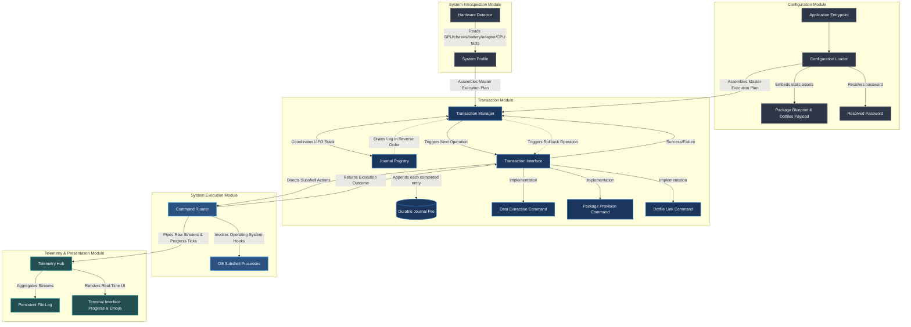
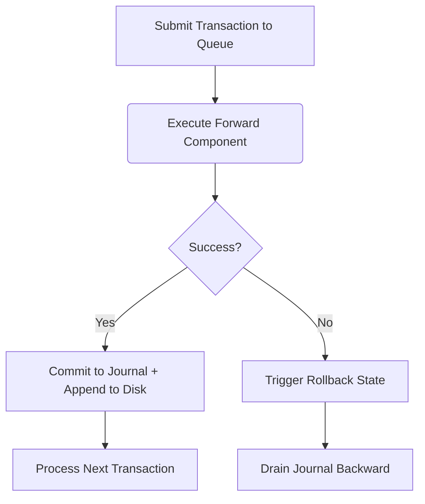

# Architecture — Provision Phase

The project has 5 core components:

## Configuration Module

**Responsibility**: Ingests the baseline instructions and processes parameters required for runtime.

**Core Components**:

- **Asset Loader**: Bakes the static package configuration strings and the entire dotfiles folder payload directly into the binary compile unit.

- **Password Resolver**: Queries the environment state or reads a local `.env` file to resolve the single administrative password needed to authenticate privileged operations (e.g., `sudo pacman`) later in the run.

- **Outputs**: Generates a global Runtime Context data structure used by downstream execution modules.

## System Introspection Module

**Responsibility**: Interrogates the active host hardware to make real-time, hardware-conditional package decisions.

**Core Components**:

- **Hardware Detector**: Examines host system metadata at runtime to identify the active GPU vendor, chassis/form factor (laptop, desktop, virtual machine), battery presence, wireless/bluetooth adapter presence, and CPU vendor. Reads are filesystem-based (`/sys/class/drm`, `/sys/class/power_supply`, `/sys/class/net`, `/proc/cpuinfo`) so this module has no external process dependency beyond a fallback to `lspci` when PCI sysfs data is unavailable.

- **Outputs**: Generates a System Profile indicating which conditional package groups must be merged into the installation stream.

## Transactional Engine Module

**Responsibility**: The core coordinator of system transformations and lifecycle safety.

**Core Components**:

- **Journal Registry**: An append-only registry that records successfully executed operations, kept both as an in-memory LIFO stack (for driving rollback within the current run) and appended incrementally to a durable journal file on disk (`/tmp/nirioly/journal-<timestamp>.jsonl`), so a completed step is never lost even if the process crashes before finishing. Note: the current requirements only call for rollback *within* the same run after a failure — the on-disk journal gives you a forensic record after a crash, not automatic resume-and-rollback on the next invocation. That would be a separate feature if you want it later.

- **Transaction Interface**: A strict structure requirement where any operation must natively possess two methods: a forward execution instruction and a corresponding reverse rollback instruction.

- **Concrete Actions**: Individual implementation blocks satisfying the core transaction structure:
  - **Data Extraction Command**: Extracts the embedded package manifest and dotfiles payload into the temp directory.
  - **Package Provision Command**: Installs target system dependencies (core + hardware-conditional).
  - **Dotfile Link Command**: Mounts user configurations to target pathways via `stow`.

## System Execution Module

**Responsibility**: The execution arm that communicates directly with the bare operating system.

**Core Components**:

- **Command Runner**: Spawns native shell processes (`pacman`, `stow`).

- **Stream Hijacker**: Intercepts low-level subshell standard output and error channels in real time, keeping the master console empty.

## Telemetry & Presentation Module

**Responsibility**: Handles reporting to the user and underlying system logging.

**Core Components**:

- **File Sink**: Generates persistent, timestamped text files inside temporary storage (`/tmp/nirioly/`) to capture the unfiltered output of every executed subshell command.

- **Terminal Interface**: Intercepts status changes emitted by the transactional engine, translating them into status emojis and a fluid progress bar.

## Diagrams

### Module Structure

### Core Flow Diagram

