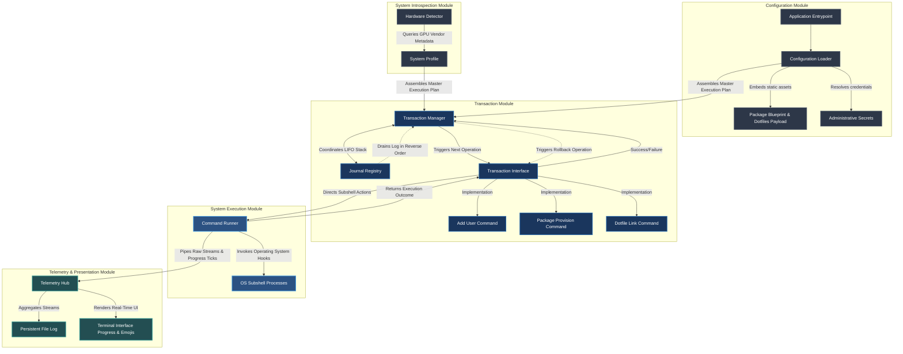
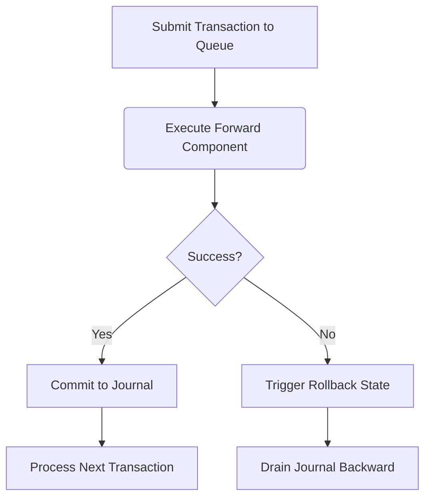

# Architecture

The project will have 5 core components:

## Configuration Module

**Responsibility**: Ingests the baseline instructions and processes parameters required for runtime.

**Core Components**:

- **Asset Loader**: Bakes the static package configuration strings and the entire dotfiles folder payload directly into the binary compile unit.

- **Secret Manager**: Queries the environment state or reads local variables to resolve sensitive parameters like primary administrative passwords securely.

- **Outputs**: Generates a global Runtime Context data structure used by downstream execution modules.

## System Introspection Module

**Responsibility**: Interrogates the active host hardware to make real-time setup adjustments.

**Core Components**:

- **Hardware Detector**: Examines the host system metadata at runtime to identify the active GPU vendor (AMD, Intel, or NVIDIA).

- **Outputs**: Generates a System Profile indicating the exact graphical driver targets that must be merged into the installation stream.

## Transactional Engine Module

**Responsibility**: The core coordinator of system transformations and lifecycle safety.

**Core Components**:

- **Journal Stack**: An append-only memory registry that logs successfully executed operations. It behaves as a Last-In, First-Out (LIFO) memory structure.

- **Transaction Interface**: A strict structure requirement where any operation must natively possess two methods: a forward execution instruction and a corresponding reverse rollback instruction.

- **Concrete Actions**: Individual implementation blocks satisfying the core transaction structure:
  - **Add User Command**: Manages system account initialization and permissions updates.
  - **Package Provision Command**: Installs target system dependencies.
  - **Dotfile Link Command**: Mounts user configurations to target pathways.

## System Execution Module

**Responsibility**: The execution arm that communicates directly with the bare operating system.

**Core Components**:

- **Command Runner**: Spawns native shell processes (useradd, pacman, stow).

- **Stream Hijacker**: Intercepts low-level subshell standard output and error channels in real time, keeping the master console empty.

## Telemetry & Presentation Module

**Responsibility**: Handles reporting to the user and underlying system logging.

**Core Components**:

- **File Sink**: Generates persistent, timestamped text files inside temporary storage (/tmp/) to capture the unfiltered output of every executed subshell command.

- **Terminal Interface**: Intercepts status changes emitted by the transactional engine, translating them into status emojis and a fluid progress bar.

## Diagrams

### Module Structure

### Core Flow Diagram

