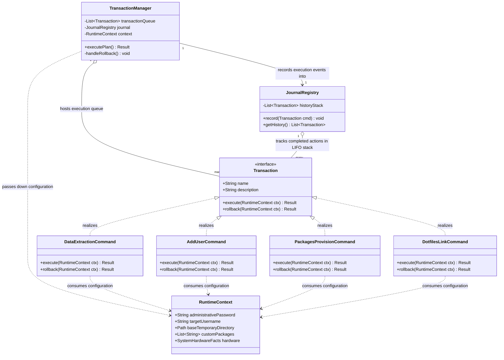
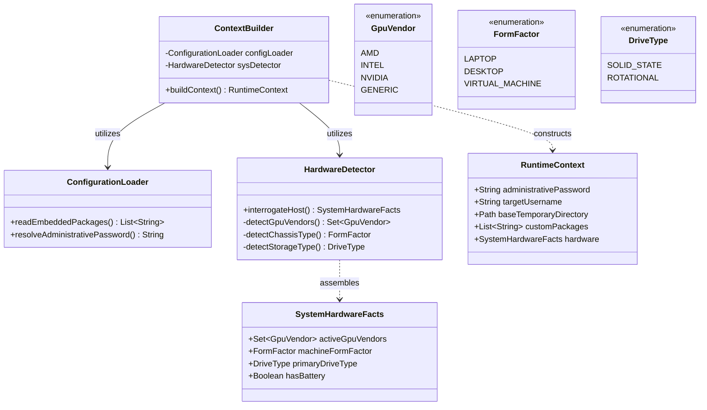
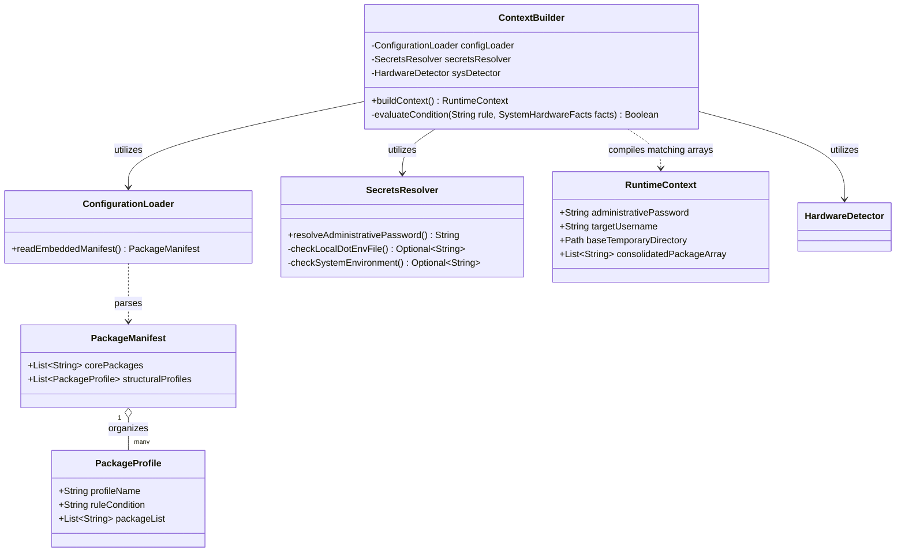

# Design

This file will contain all designs of each component exposed in the [architecture](./architecture.md) file.

## Transactional Engine Module

A **command pattern** will be used. Each command will be represented by an interface with the following methods and properties:

- `name`: the name of the command in plain text (could be different from the real command launched)
- `description`: the description of what does the command do
- `execute(ctx)`: method that executes the command, having injected the current context
- `rollback(ctx)`: method that reverts the changes performed in the execute method

### Concrete Commands

#### Data extraction command

- Name: data extraction
- Description: extracts `packages.conf` file and `dotfiles/` directory from the binary, placing them inside the temp directory of the current OS.

#### Add user command

- Name: add user
- Description: invokes system hooks to create the account, generate the home directory structure, and append security rules to the host's privilege configuration file (`sudoers`).

#### Packages provision command

- Name: packages provision
- Description: Invokes the host package manager with system parameters flags (`--needed` `--noconfirm`) to synchronize and download the package list

#### Dotfiles link command

- Name: dotfiles link
- Description: Invokes the linking engine (`stow --restow`) to map symlinks from the temporary store into the active environment.

### Journal Registry

It takes as input an action that will be tracked in the journal.

### Transaction Manager

It orchestrates the launch of the commands along with their registration inside the journal. If ever an error occurs, it is responsible of triggering the rollback.

### Class Diagram

## System Introspection Module

This module is responsible of providing information grasped from the bare metal. It should be able to be extensible as much as wanted. It will be the provider of the context passed to the transaction engine.

## Configuration Module

This module is responsible of loading configuration file and provide its information to the context builder. It should also take care of lading sensible information from either `.env` or envvars.

