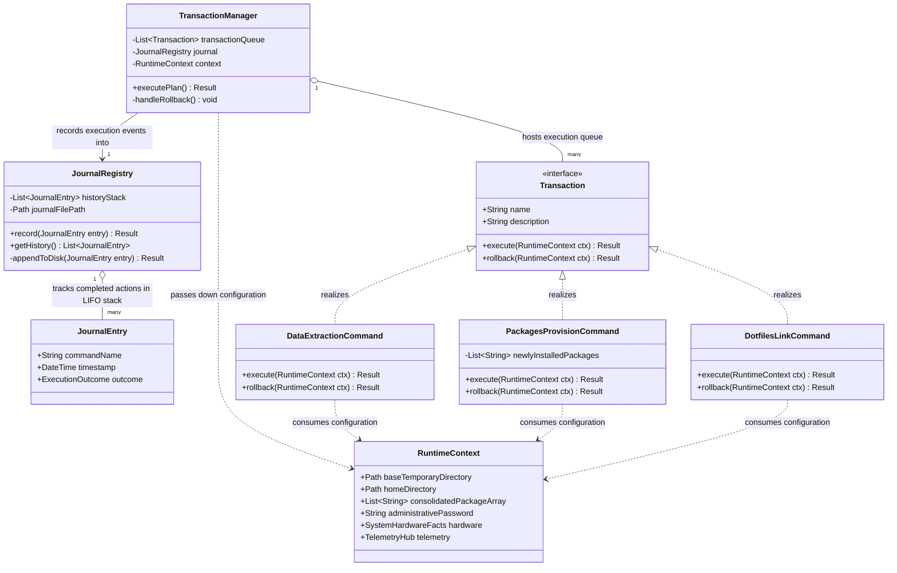
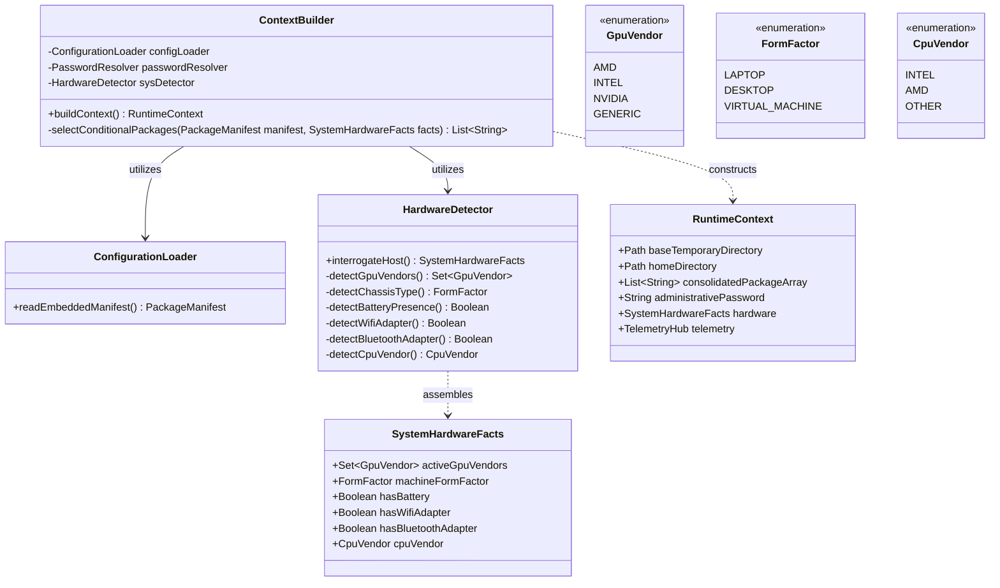
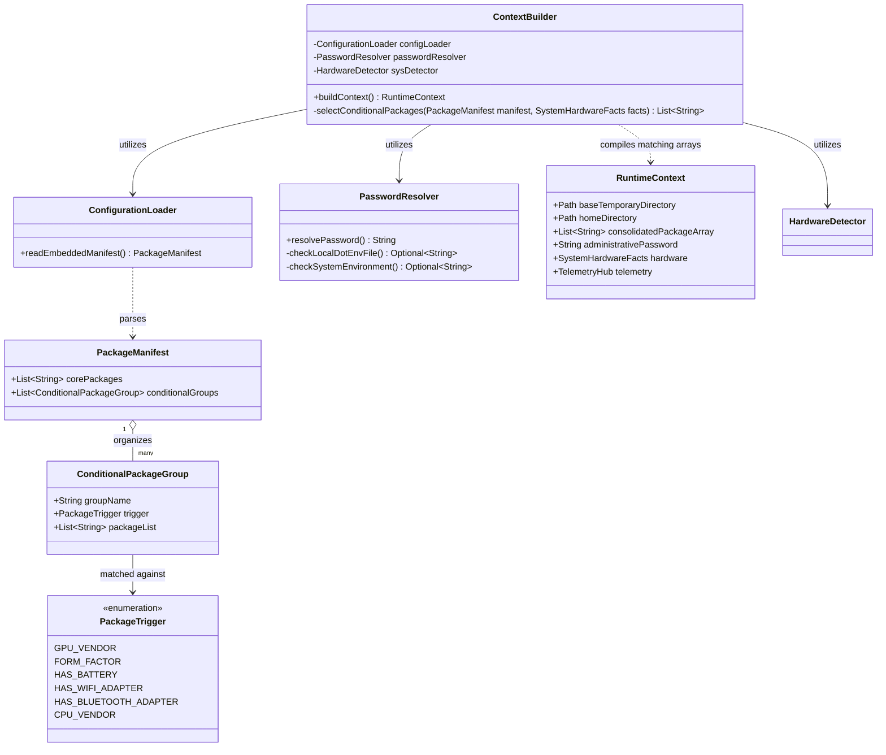
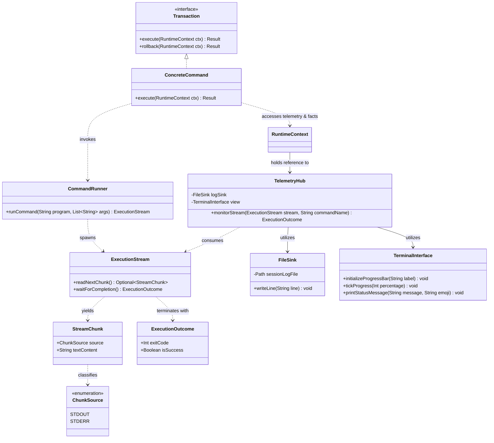

# Design

This file contains the design of each component exposed in the [architecture](./architecture.md) file, for the Provision Phase.

## Transactional Engine Module

A **command pattern** is used. Each command is represented by an interface with the following methods and properties:

- `name`: the name of the command in plain text (could be different from the real command launched)
- `description`: the description of what the command does
- `execute(ctx)`: method that executes the command, having injected the current context
- `rollback(ctx)`: method that reverts the changes performed in the execute method

### Concrete Commands

#### Data extraction command

- Name: data extraction
- Description: extracts `package.conf` and the `dotfiles/` directory from the binary, placing them inside the temp directory of the current OS.
- Rollback: deletes the extracted temp directory.

#### Packages provision command

- Name: packages provision
- Description: before installing anything, checks each target package's current installation status on the host and records which ones are not yet present. Then invokes the host package manager with system parameter flags (`--needed` `--noconfirm`) to synchronize and download the full package list (core packages + hardware-conditional packages).
- Rollback: uninstalls **only** the packages that were confirmed absent immediately before this run's install step and were installed by this run — never a package that was already present on the host beforehand, even if it's also part of the requested list. Removing something that predates this run risks breaking whatever already depended on it, which is a worse outcome than leaving a redundant package alone. Beyond that distinction, rollback is still best-effort: if something installed later in the same run came to depend on one of these newly-installed packages, removing it can break more than it fixes. The rollback should report packages it could not safely remove rather than force-removing them (see NFR-3).

#### Dotfiles link command

- Name: dotfiles link
- Description: invokes the linking engine (`stow --restow`) to map symlinks from the temporary store into the invoking user's home directory.
- Rollback: removes the symlinks created by this run (`stow -D`).

### Journal Registry

Takes as input a completed action (a `JournalEntry`) to record. Two things happen on `record()`:

1. The entry is pushed onto an in-memory LIFO stack, used to drive rollback if a later step in the *same run* fails.
2. The entry is appended as a line to a durable journal file on disk (`/tmp/nirioly/journal-<timestamp>.jsonl`), so the record of what completed survives a crash, even though this phase's rollback logic only acts within the current run.

### Transaction Manager

Orchestrates the launch of the commands along with their registration inside the journal. If an error occurs, it is responsible for triggering the rollback by draining the journal in reverse order.

### Hardware-conditional package selection

Rather than a generic string-based "rule" evaluated at runtime, conditional package groups are matched against hardware facts through a fixed, closed set of trigger kinds — one per hardware fact that can gate a package group: GPU vendor, form factor, battery presence, wifi adapter presence, bluetooth adapter presence, and CPU vendor. Each conditional group declares exactly one trigger. Matching is then a direct comparison against the corresponding field on the hardware facts — no string parsing, no rule-syntax validation, nothing that can be malformed at runtime:

- trigger "GPU vendor is NVIDIA" → check whether NVIDIA is present in the detected set of GPU vendors
- trigger "form factor is LAPTOP" → check whether the detected form factor equals LAPTOP
- trigger "has battery" → read the boolean fact directly
- trigger "has wifi adapter" / "has bluetooth adapter" → read the corresponding boolean fact directly
- trigger "CPU vendor is AMD" → check whether the detected CPU vendor equals AMD

The context builder walks every conditional group, keeps the ones whose trigger matches, and flattens their packages into the consolidated package list alongside the core packages.

Because the trigger kinds are a closed, finite set known up front, this can be implemented as a fixed enumeration matched exhaustively, rather than as free-form text interpreted at runtime — so an unhandled or misspelled trigger becomes something that's caught during development, not something that silently does nothing when the tool runs on someone's machine.

`ContextBuilder` walks the manifest's `conditionalGroups`, keeps the ones where `matches()` returns true, and flattens their `packages` into `consolidatedPackageArray` alongside `corePackages`.

### Class Diagram

## System Introspection Module

This module is responsible for providing information gathered from the bare metal. It should be extensible. It is the provider of the hardware facts consumed by the transaction engine's package-selection step.

## Configuration Module

This module loads the embedded configuration and provides it to the context builder, and takes care of resolving the administrative password from either `.env` or an environment variable.

`PackageTrigger` is shown here as a plain enumeration for diagram purposes; a real implementation would typically attach data to some of its variants (which GPU vendor, which CPU vendor) rather than matching by a string comparison — see the description under "Hardware-conditional package selection" above for the full behavior.

## System Execution Module

This module serves as the execution arm that communicates directly with the bare operating system. It isolates low-level subshell execution details and prevents messy subshell output from cluttering the master terminal console.

### Core Components

#### Command Runner

**Responsibility**: Spawns native system processes, executes commands inside the underlying operating system environment, and handles task execution status outcomes.

#### Stream Hijacker

**Responsibility**: Attaches directly to the subshell's standard output (stdout) and standard error (stderr) streams to intercept data chunks in real time, exposing these streams to downstream observers.

## Telemetry and Presentation Module

This module handles real-time visual progress reporting to the user and manages underlying raw diagnostic data persistence.

### Core Components

#### File Sink

**Responsibility**: Generates timestamped text files inside persistent temporary storage (`/tmp/nirioly/`) to write out the unfiltered, raw text streams passed by the execution modules. This is separate from the Journal Registry's own journal file — the File Sink captures raw subshell noise, while the journal file captures structured, completed-transaction records for rollback purposes.

#### Terminal Interface

**Responsibility**: Consumes progress ticks and execution metrics to render user-facing updates, leveraging a clean loading progress bar and contextual emojis.

